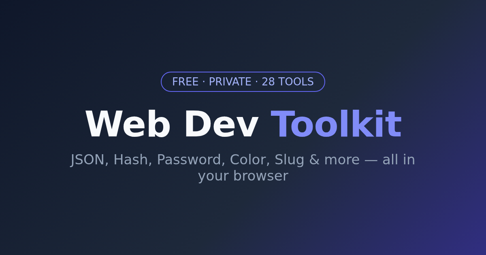

# 🛠️ Web Dev Toolkit — 24 Free Browser-Based Tools + 7 Games

> **Live site:** https://pyfile-toolkit.github.io/web-toolkit/
>
> Every tool is a single HTML file that runs 100% in your browser. **No installation, no server, no accounts, no data leaves your computer.** Free forever.

## 🚀 Quick Links

| | |
|---|---|
| ▶ **Launch the toolkit** | [pyfile-toolkit.github.io/web-toolkit](https://pyfile-toolkit.github.io/web-toolkit/) |
| 📚 **Dev guides** | [YAML vs JSON](guides/yaml-vs-json.html) · [WCAG Contrast Explained](guides/wcag-contrast-explained.html) |
| 💎 **Premium products** | [pyfiletoolkit.gumroad.com](https://pyfiletoolkit.gumroad.com/) |
| ☕ **Support (ko-fi)** | [ko-fi.com/pyfiletoolkit](https://ko-fi.com/pyfiletoolkit) |

## 🧰 Developer Tools

| Tool | Description |
|------|-------------|
| [JSON Formatter](json-formatter.html) | Validate, format & minify JSON |
| [YAML ⇄ JSON](yaml-json-converter.html) | Convert config files both ways |
| [CSV ⇄ JSON](csv-json-converter.html) | Two-way RFC-4180 conversion |
| [JSON Schema Validator](json-schema-validator.html) | Validate data against a schema |
| [SQL Formatter](sql-formatter.html) | Beautify queries: JOINs, subqueries, CASE |
| [Regex Tester](regex-tester.html) | Live match highlighting + capture groups |
| [JWT Decoder](jwt-decoder.html) | Decode tokens, exp/iat as dates |
| [Base64 Encoder](base64.html) | Encode/decode text or files |
| [UUID Generator](uuid-generator.html) | v4 UUIDs, bulk mode |
| [Hash Generator](hash-generator.html) | MD5, SHA-1/256/512, HMAC |
| [HTML Minifier](html-minifier.html) | Compress HTML, pre-safe |
| [CSS Minifier](css-minifier.html) | Minify stylesheets |
| [JS Minifier](js-minifier.html) | Minify JavaScript |
| [HTML Encoder](html-encoder.html) | Escape/unescape entities |
| [URL Encoder](url-encoder.html) | Encode/decode URI components |
| [Text Diff](text-diff.html) | Side-by-side comparison |
| [HTTP Status Codes](http-status-codes.html) | 62 codes reference, searchable |
| [Unix Timestamp](unix-timestamp-converter.html) | Epoch ↔ date converter |
| [Percentage Calculator](percentage-calculator.html) | 5 modes |
| [Color Converter](color-converter.html) | HEX/RGB/HSL/CMYK |
| [Color Palette](color-palette.html) | Harmonious schemes |
| [Color Contrast Checker](contrast-checker.html) | WCAG AA/AAA ratios |
| [Password Generator](password-generator.html) | Strong passwords, bulk |
| [Password Strength](password-strength.html) | zxcvbn-grade meter |
| [Slug Generator](slug-generator.html) | URL-friendly slugs |
| [Word Counter](word-counter.html) | Words, chars, reading time |
| [Character Counter](character-counter.html) | Live counts |
| [Case Converter](case-converter.html) | 10 name cases |
| [Markdown Preview](markdown-preview.html) | Live editor + export |
| [Image Resizer](image-resizer.html) | Bulk resize in browser |
| [QR Code Generator](qrcode.html) | QR from URL/text |
| [YouTube Tag Generator](youtube-tag-generator.html) | SEO tags from keywords |
| [Lorem Ipsum](lorem-ipsum-generator.html) | Paragraphs/sentences/words |

## 🎮 Games & Tests

| Game | Description |
|------|-------------|
| [The Shift](the-shift.html) | Minimal brain-training puzzle |
| [Karma](karma.html) | Zen clicker with philosophy |
| [Brandseed](brandseed.html) | Startup name generator |
| [Reaction Time Test](reaction-time.html) | Measure reflexes in ms |
| [Typing Speed Test](typing-test.html) | WPM + accuracy |
| [Simon Says](simon-says.html) | Memory sequence game |

## 📚 Guides

- [YAML vs JSON: Key Differences, Use Cases, and Conversion Guide](guides/yaml-vs-json.html)
- [WCAG Color Contrast Explained: AA/AAA Ratios, Formula, and How to Check](guides/wcag-contrast-explained.html)

## 🔒 Privacy

All tools are client-side only. Nothing you paste, type, or upload ever leaves your browser — no analytics on tool input, no tracking of your data. See [privacy.html](privacy.html).

## 💰 Support & Premium

The toolkit is free and ad-free. If it saves you time:

- **☕ Buy me a coffee** — [ko-fi.com/pyfiletoolkit](https://ko-fi.com/pyfiletoolkit)
- **💎 Premium products** (source access, commercial license, priority support) — [pyfiletoolkit.gumroad.com](https://pyfiletoolkit.gumroad.com/)

## ⭐ Star this repo

If you find these tools useful, a star helps more developers discover them. Thank you!

---

*Built for developers, by an indie dev. All tools work offline once loaded.*